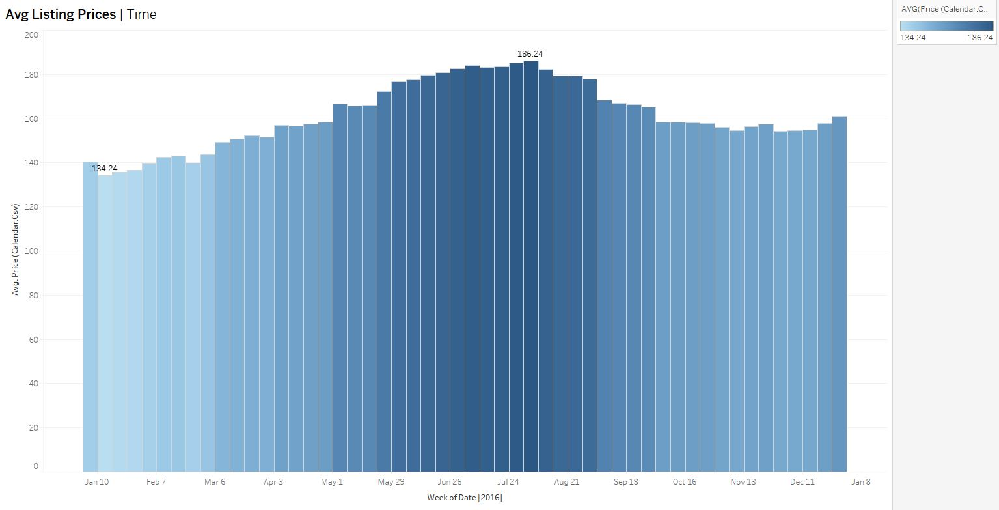

# Airbnb Market Insights

## Project Overview
This project analyzes Airbnb listings data to provide insights for those looking to start an Airbnb business. Using Tableau visualizations and data analytics, we explore key market trends, optimal investment locations, and strategies to maximize rental income.

## Objectives
The primary objectives of this project are:
- **Identify the best locations for buying a property for Airbnb rental.**
- **Determine the best time to list properties.**
- **Explore market preferences in terms of property types.**
- **Provide data-driven insights for optimizing Airbnb business performance.**

## Tableau Visualizations
The project includes a series of interactive Tableau dashboards covering:
- **Avg Price by Zipcode**: Barchart and Map showing the most profitable locations.
- **Revenue for Year**: Line charts illustrating when demand is highest.
- **Popular Property Types and Bedroom Counts**: Bar charts analyzing market preferences.
- **Avg Price per Bedrooms**: Stacked bar charts showing price distribution based on bedroom count.

Visit the [Tableau Dashboard](https://public.tableau.com/app/profile/farid.ghorbani/viz/shared/FDN762Z7C) to explore the visualizations and insights.

## Key Questions and Insights

### 1. Where Should I Buy a Home to Start an Airbnb Business?
- **Analysis:** We evaluated neighborhoods based on average revenue.
- **Visualization:** A heatmap of Avg Price by Zip code.
- **Insight:** High-revenue neighborhoods were identified as prime investment locations.

### 2. What Is the Best Time to List the Home?
- **Analysis:** Seasonal trends were analyzed to find peak booking periods.
- **Visualization:** Line chart showing revenue trends throughout the year.
- **Insight:** The analysis revealed that bookings peak during the summer season and at the end of the year, indicating the optimal listing periods.

### 3. What Is the Most Common Number of Bedrooms for Listings?
- **Analysis:** The distribution of bedroom counts was assessed to understand market demand.
- **Visualization:** Bar chart showing the number of listings by bedroom count.
- **Insight:** Properties with 1 bedrooms are the most popular, making them a safe investment choice.

### 4. What Is the Relationship Between Price and Review Scores?
- **Analysis:** A scatter plot was used to assess the connection between listing price and guest satisfaction.
- **Visualization:** Scatter plot with price on the x-axis and review score on the y-axis.
- **Insight:** The analysis indicated that listings priced between $60 and $150 have the highest review scores, guiding effective pricing strategies.

### 5. How Does the Number of Reviews Impact Booking Trends?
- **Analysis:** The relationship between the number of reviews and price was explored.
- **Visualization:** Bubble chart showing reviews against booking trends.
- **Insight:** There is no significant correlation between the number of reviews and price.

### 6. How Do Listing Prices Change Over Time?
- **Analysis:** Price trends over different periods were analyzed to determine the most profitable pricing strategy.
- **Visualization:** Time series line chart of average price over time.
- **Insight:** Pricing peaks during the summer season, suggesting that a dynamic pricing strategy could maximize income.

## Conclusions and Recommendations
Based on the insights from this analysis:
1. **Focus on High-Revenue Areas**: When investing in an Airbnb property, target neighborhoods with proven high average revenue.
2. **Seasonal Listing Strategy**: Align your listing dates with peak booking seasons to optimize occupancy and revenue.
3. **Invest in Popular Property Types**: Concentrate on properties with 1 bedroom, as they are in highest demand.
4. **Refine Pricing Strategies**: Set prices within the $60 to $150 range to maximize review scores while remaining competitive in the market.
5. **Enhance Listings with Key Amenities**: Since guest satisfaction is influenced by amenities, ensure your property is well-equipped to stand out from competitors.
6. **Monitor Market Trends Regularly**: Continuously track price trends and adjust your pricing strategy to align with seasonal demand and market shifts.

## Dataset
The dataset used in this analysis includes a wide range of attributes such as property details, host information, pricing, availability, and guest reviews.

### Key Attributes:
- **Location Data**: City, neighborhood, latitude, longitude
- **Property Data**: Type, room count, price, amenities
- **Host Data**: Response rate, listings count, reviews
- **Calendar Data**: Availability, pricing, booking trends

## Acknowledgments
This project uses Airbnb data sourced from [Kaggle](https://www.kaggle.com/datasets/airbnb/seattle).
